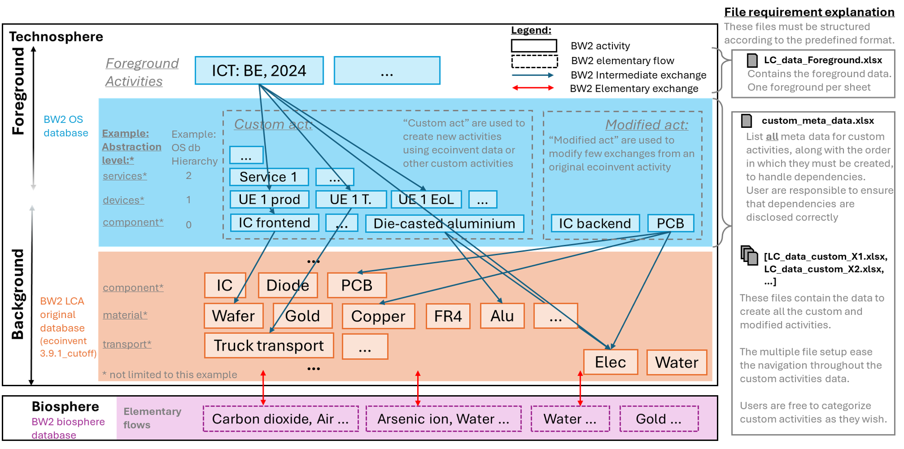

> [!WARNING]  
> Please be aware that this is still a work in progress.
> Breaking changes are to be expected in the future.
# ECS-LCA
This repository contains the framework used by the ECS group at ICTeam in UCLouvain.


# Installation

Clone this repository.
Dependencies installation will depend on your Python framework.

## conda
```
conda create -n ECS-LCA
conda activate ECS-LCA
conda install --yes --file requirements.txt
jupyter notebook main.ipynb
```
## pipenv
```
pipenv install -r requirements.txt --python 3.10
pipenv run python -m ipykernel install --user --name=ECS-LCA
pipenv run jupyter notebook main.ipynb
```

# EcoInvent
> [!WARNING]  
> Forgetting to give an access to EcoInvent will lead to errors.

Modify the file `src/credentials/__init__.py` to give access to your EcoInvent database. Either give the path to your local version of the database with its name or give your credentials to download it.


# Repo structure
- `main.ipynb` is the notebook from which users can do their LCA.
- `sheets` contains all tables describing the foreground. Enter your custom databases here.
- `src` contains the custom python packages.
